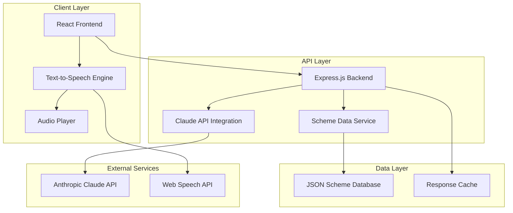
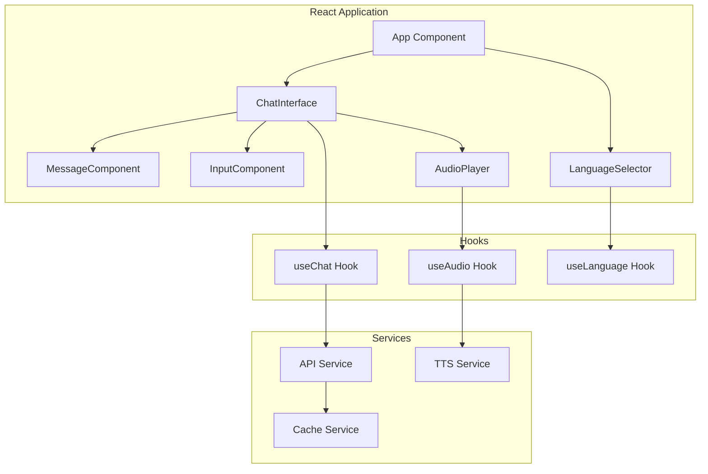

# Design Document: Jan-Sevak AI Chatbot

## Overview

Jan-Sevak is a React-based web application that serves as an AI-powered chatbot to help rural Indians understand and access government schemes. The system combines natural language processing through Claude API, text-to-speech capabilities, and a mobile-first responsive design to bridge the gap between complex government documentation and citizens who face language barriers and low digital literacy.

The application follows a client-server architecture where the React frontend handles user interactions and audio playback, while a backend API manages Claude AI integration and scheme data retrieval. The system prioritizes simplicity, accessibility, and performance for users with basic smartphones and limited internet connectivity.

## Architecture

### High-Level Architecture



### Component Architecture



## Components and Interfaces

### Frontend Components

#### ChatInterface Component
```typescript
interface ChatInterfaceProps {
  language: 'hi' | 'en';
  onLanguageChange: (lang: 'hi' | 'en') => void;
}

interface Message {
  id: string;
  text: string;
  sender: 'user' | 'bot';
  timestamp: Date;
  audioUrl?: string;
  isLoading?: boolean;
}
```

#### AudioPlayer Component
```typescript
interface AudioPlayerProps {
  audioUrl: string;
  text: string;
  language: 'hi' | 'en';
  onPlaybackComplete?: () => void;
}

interface AudioControls {
  play: () => void;
  pause: () => void;
  stop: () => void;
  setPlaybackRate: (rate: number) => void;
  replay: () => void;
}
```

#### InputComponent
```typescript
interface InputComponentProps {
  onSubmit: (message: string) => void;
  disabled: boolean;
  placeholder: string;
  language: 'hi' | 'en';
}
```

### Backend API Interfaces

#### Chat API Endpoint
```typescript
interface ChatRequest {
  message: string;
  language: 'hi' | 'en';
  sessionId?: string;
}

interface ChatResponse {
  response: string;
  audioUrl?: string;
  relatedSchemes: SchemeInfo[];
  followUpQuestions?: string[];
  sessionId: string;
}
```

#### Scheme Data Interface
```typescript
interface SchemeInfo {
  id: string;
  name: string;
  nameHindi: string;
  description: string;
  descriptionHindi: string;
  eligibility: EligibilityInfo;
  benefits: string[];
  benefitsHindi: string[];
  applicationProcess: ApplicationStep[];
  requiredDocuments: string[];
  officialLink: string;
  category: SchemeCategory;
}

interface EligibilityInfo {
  ageRange?: { min: number; max: number };
  incomeLimit?: number;
  occupation?: string[];
  gender?: 'male' | 'female' | 'any';
  landOwnership?: boolean;
  additionalCriteria: string[];
}

interface ApplicationStep {
  stepNumber: number;
  description: string;
  descriptionHindi: string;
  requiredDocuments: string[];
  estimatedTime: string;
}

enum SchemeCategory {
  AGRICULTURE = 'agriculture',
  HEALTH = 'health',
  EDUCATION = 'education',
  HOUSING = 'housing',
  BUSINESS = 'business',
  SOCIAL_SECURITY = 'social_security'
}
```

### Service Interfaces

#### Claude AI Service
```typescript
interface ClaudeService {
  processQuery(query: string, language: string, context?: ConversationContext): Promise<ClaudeResponse>;
  generateEligibilityQuestions(scheme: SchemeInfo, userProfile: UserProfile): Promise<string[]>;
  assessEligibility(scheme: SchemeInfo, answers: EligibilityAnswer[]): Promise<EligibilityResult>;
}

interface ConversationContext {
  previousMessages: Message[];
  userProfile?: UserProfile;
  currentScheme?: string;
}

interface ClaudeResponse {
  text: string;
  confidence: number;
  detectedIntent: string;
  suggestedSchemes: string[];
  requiresFollowUp: boolean;
}
```

#### Text-to-Speech Service
```typescript
interface TTSService {
  synthesize(text: string, language: 'hi' | 'en'): Promise<string>;
  getAvailableVoices(language: string): SpeechSynthesisVoice[];
  setVoiceSettings(settings: VoiceSettings): void;
}

interface VoiceSettings {
  rate: number; // 0.1 to 10
  pitch: number; // 0 to 2
  volume: number; // 0 to 1
  voice?: SpeechSynthesisVoice;
}
```

## Data Models

### Scheme Database Structure

The scheme database will be implemented as structured JSON files for the MVP, with the following organization:

```
/data/schemes/
├── agriculture/
│   ├── pm-kisan.json
│   └── fasal-bima.json
├── health/
│   └── ayushman-bharat.json
├── education/
│   └── national-scholarship.json
├── housing/
│   └── pm-awas.json
├── business/
│   ├── mudra-loan.json
│   └── pm-svanidhi.json
└── social-security/
    ├── sukanya-samriddhi.json
    └── atal-pension.json
```

### Sample Scheme Data Model (PM-KISAN)
```json
{
  "id": "pm-kisan",
  "name": "Pradhan Mantri Kisan Samman Nidhi",
  "nameHindi": "प्रधानमंत्री किसान सम्मान निधि",
  "description": "Income support scheme providing Rs 6000 per year to small and marginal farmers",
  "descriptionHindi": "छोटे और सीमांत किसानों को प्रति वर्ष 6000 रुपये की आय सहायता योजना",
  "category": "agriculture",
  "benefits": [
    "Rs 6000 per year in three installments",
    "Direct bank transfer",
    "No application fee"
  ],
  "benefitsHindi": [
    "तीन किस्तों में प्रति वर्ष 6000 रुपये",
    "सीधे बैंक खाते में ट्रांसफर",
    "कोई आवेदन शुल्क नहीं"
  ],
  "eligibility": {
    "landOwnership": true,
    "incomeLimit": null,
    "occupation": ["farmer"],
    "additionalCriteria": [
      "Must own cultivable land",
      "Land records should be updated",
      "Valid bank account required"
    ]
  },
  "requiredDocuments": [
    "Land ownership documents",
    "Aadhaar card",
    "Bank account details",
    "Mobile number"
  ],
  "applicationProcess": [
    {
      "stepNumber": 1,
      "description": "Visit PM-KISAN portal or nearest CSC",
      "descriptionHindi": "PM-KISAN पोर्टल या नजदीकी CSC पर जाएं",
      "requiredDocuments": ["Aadhaar card", "Land documents"],
      "estimatedTime": "15 minutes"
    },
    {
      "stepNumber": 2,
      "description": "Fill registration form with personal and land details",
      "descriptionHindi": "व्यक्तिगत और भूमि विवरण के साथ पंजीकरण फॉर्म भरें",
      "requiredDocuments": ["Bank account details"],
      "estimatedTime": "10 minutes"
    },
    {
      "stepNumber": 3,
      "description": "Submit form and get acknowledgment receipt",
      "descriptionHindi": "फॉर्म जमा करें और पावती रसीद प्राप्त करें",
      "requiredDocuments": [],
      "estimatedTime": "5 minutes"
    }
  ],
  "officialLink": "https://pmkisan.gov.in/",
  "lastUpdated": "2024-01-15",
  "commonQuestions": [
    {
      "question": "How much money do I get?",
      "questionHindi": "मुझे कितने पैसे मिलेंगे?",
      "answer": "You get Rs 6000 per year in three installments of Rs 2000 each",
      "answerHindi": "आपको प्रति वर्ष 6000 रुपये तीन किस्तों में 2000 रुपये की मिलते हैं"
    }
  ]
}
```

### User Session Model
```typescript
interface UserSession {
  sessionId: string;
  language: 'hi' | 'en';
  conversationHistory: Message[];
  userProfile?: UserProfile;
  currentContext?: {
    activeScheme?: string;
    eligibilityInProgress?: boolean;
    lastActivity: Date;
  };
  createdAt: Date;
  expiresAt: Date;
}

interface UserProfile {
  age?: number;
  occupation?: string;
  location?: {
    state: string;
    district?: string;
  };
  landOwnership?: boolean;
  annualIncome?: number;
  familySize?: number;
}
```

## Correctness Properties

*A property is a characteristic or behavior that should hold true across all valid executions of a system—essentially, a formal statement about what the system should do. Properties serve as the bridge between human-readable specifications and machine-verifiable correctness guarantees.*

### Property 1: Multi-language Query Processing
*For any* user query in Hindi or English, the Jan_Sevak_System should successfully process the input and extract meaningful intent without errors
**Validates: Requirements 1.1, 1.2**

### Property 2: Scheme Identification Accuracy
*For any* query related to a covered government scheme, the system should correctly identify the most relevant scheme from the database
**Validates: Requirements 1.3**

### Property 3: Query Variation Handling
*For any* set of queries expressing the same intent using different words or phrases, the system should identify the same relevant scheme consistently
**Validates: Requirements 1.4**

### Property 4: Clarification for Ambiguous Queries
*For any* ambiguous or unclear query, the system should respond with clarifying questions in the user's preferred language rather than providing incorrect information
**Validates: Requirements 1.5, 8.4**

### Property 5: Response Simplification
*For any* generated response, the text should use everyday language, avoid bureaucratic jargon, include concrete examples, and break complex processes into simple steps
**Validates: Requirements 2.1, 2.2, 2.3, 2.4, 2.5**

### Property 6: Audio Generation Pipeline
*For any* text response generated by the system, an audio version should be automatically created and made available to the user
**Validates: Requirements 3.1**

### Property 7: Audio Player Functionality
*For any* audio response, the audio player should provide functional controls for replay, pause, and playback speed adjustment
**Validates: Requirements 3.3**

### Property 8: Audio Error Handling
*For any* audio generation or playback failure, the system should display an appropriate error message and continue functioning in text-only mode
**Validates: Requirements 3.5**

### Property 9: Scheme Database Completeness
*For any* of the 10 covered government schemes, the database should contain all required fields including name, description, eligibility criteria, benefits, application process, and required documents
**Validates: Requirements 4.1, 4.2, 4.3, 4.4, 4.5, 4.6, 4.7, 4.8, 4.9, 4.10**

### Property 10: Scheme Information Accuracy
*For any* query about a covered scheme, the system should return information that exactly matches the data stored in the scheme database
**Validates: Requirements 4.11**

### Property 11: Comprehensive Application Guidance
*For any* scheme application guidance request, the response should include complete document lists, official website links, chronologically ordered steps, and common pitfall warnings
**Validates: Requirements 5.1, 5.2, 5.3, 5.5**

### Property 12: Application Status Tracking Information
*For any* query about application status, the system should provide clear instructions on how to track the application progress
**Validates: Requirements 5.4**

### Property 13: Eligibility Assessment Flow
*For any* eligibility inquiry, the system should ask all relevant qualifying questions based on the specific scheme's criteria
**Validates: Requirements 6.1, 6.5**

### Property 14: Eligibility Question Clarity
*For any* eligibility question generated by the system, the language should be simple and easily understandable by rural users
**Validates: Requirements 6.2**

### Property 15: Eligibility Result Communication
*For any* completed eligibility assessment, the system should clearly communicate whether the user qualifies and provide appropriate next steps or alternative suggestions
**Validates: Requirements 6.3, 6.4**

### Property 16: Mobile-Responsive Interface
*For any* screen size from 320px width upward, the chat interface should display properly with appropriately sized touch targets and high contrast colors
**Validates: Requirements 7.1, 7.2, 7.3**

### Property 17: User Interface Accessibility
*For any* user interaction, the interface should provide clear loading indicators, accessible input fields, and visually distinct message styling
**Validates: Requirements 7.4, 7.5, 7.6**

### Property 18: Claude API Integration
*For any* user query, the system should successfully process it through the Claude API and handle the response appropriately
**Validates: Requirements 8.1**

### Property 19: Error Tolerance
*For any* query containing spelling mistakes or grammatical errors, the system should still process the intent and provide relevant responses
**Validates: Requirements 8.3**

### Property 20: API Failure Handling
*For any* Claude API failure or timeout, the system should provide appropriate error messages and fallback responses to maintain functionality
**Validates: Requirements 8.5**

### Property 21: Loading State Management
*For any* operation that requires network connectivity, the system should display appropriate loading states during poor connectivity conditions
**Validates: Requirements 9.3**

### Property 22: Audio File Optimization
*For any* generated audio file, the file size should be optimized for mobile delivery while maintaining acceptable quality
**Validates: Requirements 9.4**

### Property 23: Accessibility Compliance
*For any* user interface element, the system should support screen readers and keyboard navigation for users with disabilities
**Validates: Requirements 9.5**

### Property 24: Data Format Consistency
*For any* scheme data stored in the database, it should conform to the defined JSON schema structure
**Validates: Requirements 10.1**

### Property 25: Data Integrity During Updates
*For any* scheme data update operation, the system should maintain consistency across all related data fields
**Validates: Requirements 10.3**

### Property 26: Backup Data Preservation
*For any* backup operation, all scheme information and user session data should be completely preserved without loss
**Validates: Requirements 10.4**

## Error Handling

### API Error Handling
- **Claude API Failures**: Implement exponential backoff retry logic with circuit breaker pattern
- **Network Timeouts**: Provide graceful degradation with cached responses when available
- **Rate Limiting**: Queue requests and implement user-friendly waiting messages
- **Invalid Responses**: Validate API responses and provide fallback generic responses

### Audio Processing Errors
- **TTS Service Failures**: Fall back to text-only mode with clear user notification
- **Browser Compatibility**: Detect Web Speech API support and provide alternatives
- **Audio Playback Issues**: Implement error recovery with manual retry options
- **Large File Handling**: Implement streaming or chunked audio delivery for large responses

### Data Validation Errors
- **Malformed Queries**: Sanitize input and handle special characters gracefully
- **Missing Scheme Data**: Provide generic responses and log errors for data team
- **Session Management**: Handle expired sessions with seamless re-initialization
- **Language Detection**: Default to English when language detection fails

### User Interface Errors
- **Responsive Layout Issues**: Implement CSS fallbacks for unsupported features
- **Touch Target Problems**: Ensure minimum 44px touch targets on all interactive elements
- **Loading State Failures**: Provide timeout mechanisms with user retry options
- **Accessibility Failures**: Implement ARIA labels and keyboard navigation fallbacks

## Testing Strategy

### Dual Testing Approach

The Jan-Sevak system will employ both unit testing and property-based testing to ensure comprehensive coverage and correctness:

**Unit Tests** will focus on:
- Specific examples of scheme queries and expected responses
- Edge cases like empty inputs, special characters, and malformed data
- Integration points between React components and backend services
- Error conditions such as API failures and network timeouts
- Accessibility features like keyboard navigation and screen reader support

**Property-Based Tests** will focus on:
- Universal properties that hold across all inputs and scenarios
- Comprehensive input coverage through randomized test generation
- Validation of correctness properties defined in this design document

### Property-Based Testing Configuration

**Testing Framework**: We will use **fast-check** for JavaScript/TypeScript property-based testing, which integrates well with Jest and provides excellent support for generating complex test data.

**Test Configuration**:
- Each property test will run a minimum of **100 iterations** to ensure statistical confidence
- Tests will use custom generators for realistic Indian names, Hindi text, and government scheme queries
- Each test will be tagged with a comment referencing its corresponding design property

**Tag Format**: Each property-based test will include a comment in the format:
```javascript
// Feature: jan-sevak, Property 1: Multi-language Query Processing
```

**Property Test Implementation Requirements**:
- Each correctness property defined in this document must be implemented as exactly one property-based test
- Tests must generate realistic input data including Hindi and English queries
- Tests must validate both functional correctness and performance characteristics where applicable
- Tests must handle both positive and negative test cases appropriately

### Unit Testing Balance

Unit tests will complement property-based tests by:
- Testing specific user journeys with concrete examples
- Validating integration between frontend components and backend services
- Testing error handling with specific failure scenarios
- Ensuring accessibility compliance with specific assistive technology interactions

Property-based tests will handle comprehensive input coverage, while unit tests will focus on specific scenarios that demonstrate correct behavior and catch concrete implementation bugs.

### Test Data Generation

**Custom Generators** will be created for:
- Hindi and English queries about government schemes
- Realistic user profiles with varying demographics
- Government scheme data with all required fields
- Audio playback scenarios with different device capabilities
- Network conditions simulating rural connectivity issues

This dual approach ensures both comprehensive coverage through property-based testing and concrete validation through targeted unit tests, providing confidence in the system's correctness and reliability for rural Indian users.